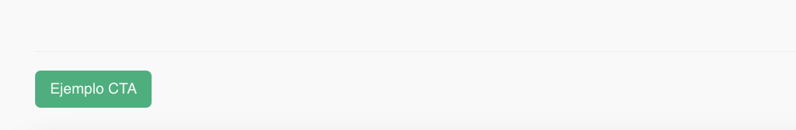

# Integración de calendly con react.js

Utilizando la librería react-calendly se logro insertar el widget de calendly a una pagina de react.

> https://www.npmjs.com/package/react-calendly

- [Inline](#inline-calendly-widget)
- [Popup](#popup-widget)
- [CTA](#cta-widget)

## Inline Calendly Widget

> [ejemplo](./src/components/Inline.jsx)

La librería permite utilizar el widget Inline para mostrar un calendario en la pagina.


```
import React from "react";
import { InlineWidget } from "react-calendly";

const App = () => {
  return (
    <div className="App">
      <InlineWidget url="https://calendly.com/your_scheduling_page" />
    </div>
  );
};

export default App;
```

### Observaciones

Poca a ninguna edición de estilo mas alla del tamaño, a pesar que la documentación hace referencia a personalización, tambien mencionan que ciertos aspectos de la personalización van a ser posibles dependiendo del plan que el usuario tenga dentro de calendly


Dicho esto, mostramos 3 versiones del inline con distintos tamaños, y aplicando distintas propiedades, aunque no tiene efecto

## Popup Widget

> [ejemplo](./src/components/Popup.jsx)

La libreria tambien ofrece un Pop Up con un FAB(Floating action Button). El color del boton y de las letras son modificables


## Cta Widget

> [ejemplo](./src/components/Cta.jsx)

Por ultimo nos habilita una opcion de utilizar un boton CTA para activar un modal/popup de calendly


